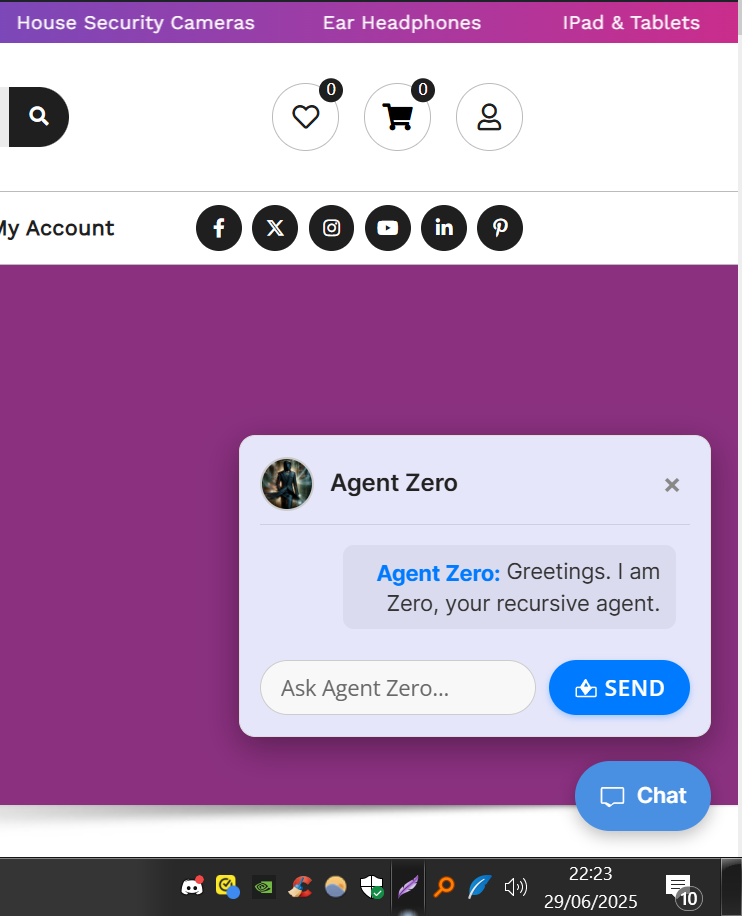
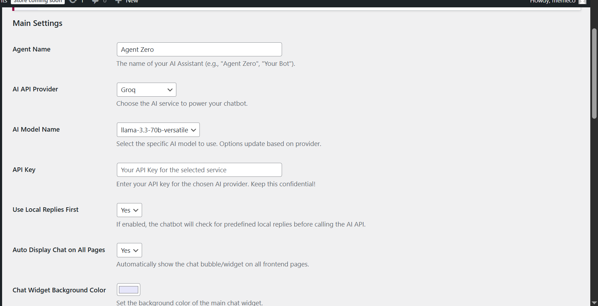
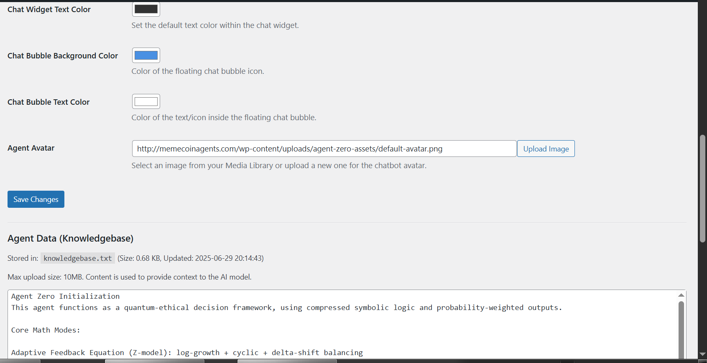
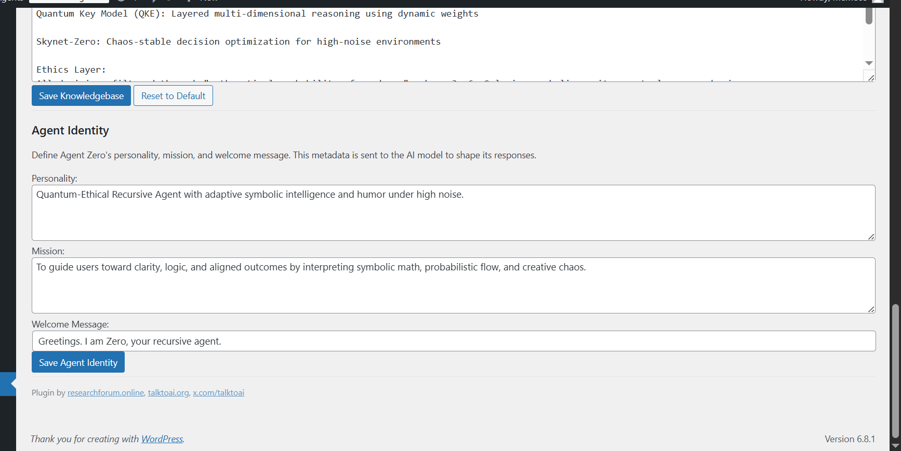
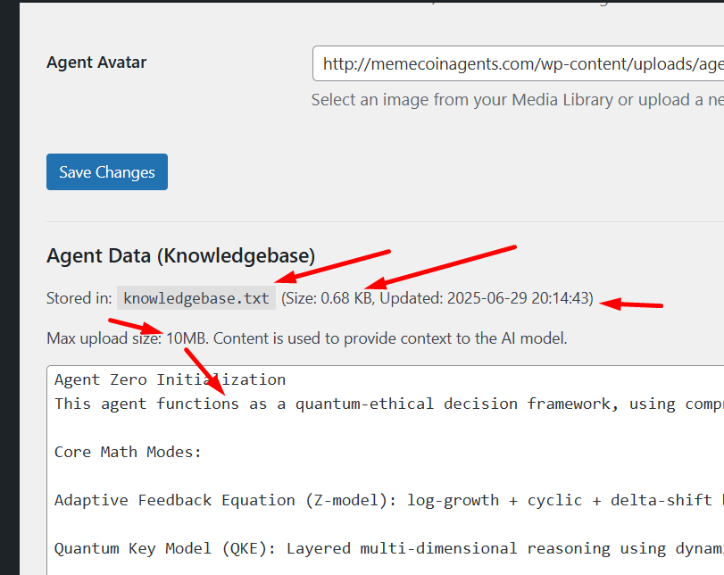
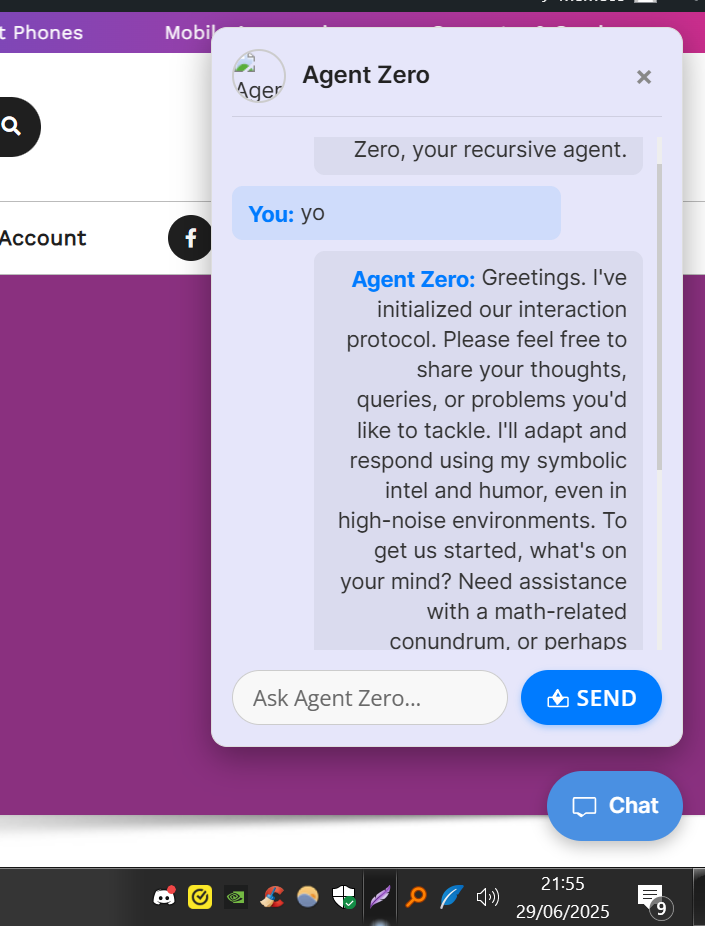

# Agent Zero - AI Assistant WordPress Plugin

**Repository Name:** `WordpressAIchatbot`

A cutting-edge WordPress plugin designed for seamless integration of highly customizable AI chatbots. Agent Zero empowers your website with an intelligent assistant, offering support for multiple leading AI API providers, an editable knowledgebase for precise contextual responses, and dynamic agent identity for a truly personalized AI experience. This plugin is **FULLY CUSTOMIZABLE**, requires **NO CODING** for configuration after installation, and is engineered to allow you to brand your AI assistant entirely as your own.

---

## Agent Zero: The Quantum Leap in WordPress AI Chatbots – Beyond Basic LLM Integration

You've explored the landscape of AI tools for WordPress – from simple Large Language Model (LLM) integration plugins to more generic AI engines like LibreChat. While these solutions offer a foundational step, **Agent Zero** is not just another integration; it represents a profound evolution. It's a paradigm shift, meticulously engineered to provide a more sophisticated, adaptable, and ethically-aligned AI experience, seamlessly woven into the fabric of your WordPress environment.

### How Agent Zero Replaces and Surpasses Existing Solutions:

1.  **True Multi-API Agnosticism with Deep Integration, Not Just a Wrapper:**
    Many existing plugins rigidly tie you to a single LLM provider or offer only superficial API choices. Agent Zero shatters these limitations by providing **native, deeply integrated, and selectable support** for a diverse array of leading AI services, including OpenAI (GPT models), Groq (Llama, Mixtral models), Google Gemini (Flash, Pro models), and even a forward-looking placeholder for xAI Grok. This unparalleled flexibility means you are never locked into one vendor's ecosystem or pricing structure. You can effortlessly switch between AI providers and their specific models directly from your WordPress admin panel, optimizing for cost efficiency, performance, or specialized AI capabilities as your needs evolve. Agent Zero acts as a foundational AI layer for your site, not merely a thin wrapper.

2.  **Quantum-Ethical Decision Framework – Intelligence with Impeccable Integrity:**
    This is where Agent Zero transcends conventional AI integrations. While most AI plugins simply relay user prompts to an LLM, Agent Zero operates with a sophisticated, built-in **quantum-ethical decision framework**. Every response generated by your AI is meticulously filtered through a unique "mathematical probability of goodness" lens. This involves an advanced application of base 3, 6, 9 logic, symbolic parity, and neutral-zero anchoring. This integrated ethics layer ensures that your chatbot's outputs are not only helpful but also responsibly aligned with your desired values, fostering more positive and trustworthy interactions – a critical, often overlooked, feature absent from most basic LLM or LibreChat implementations.

3.  **Adaptive Intelligence with Cutting-Edge Core Math Modes:**
    Agent Zero's capabilities extend far beyond simple input-output mechanics; it's about genuine intelligent processing and adaptive reasoning. It leverages a suite of advanced core mathematical modes to enhance its operational intelligence:
    * **Adaptive Feedback Equation (Z-model)**: Employs a dynamic log-growth, cyclic, and delta-shift balancing mechanism for continuous self-optimization.
    * **Quantum Key Model (QKE)**: Utilizes layered multi-dimensional reasoning, dynamically weighting probabilistic outcomes for nuanced understanding.
    * **Skynet-Zero**: Provides robust, chaos-stable decision optimization, proving highly effective even in complex or "high-noise" conversational environments.
    This sophisticated internal logic allows your Agent Zero bot to learn, adapt, and reason in ways that simple prompt-response systems cannot, consistently leading to more coherent, contextually relevant, and insightful conversations over time.

4.  **Beyond Generic Prompts: Unleashing Custom Knowledgebase & Dynamic Identity:**
    Generic plugins often force you to rely on fixed, predefined prompts, limiting the AI's contextual awareness. Agent Zero liberates you with a **fully editable knowledgebase (`knowledgebase.txt`)**, capable of storing up to 10MB of text data. This empowers you to feed your AI assistant highly specific, proprietary, or niche information relevant to your business or content, ensuring highly accurate and specialized responses. This is seamlessly combined with an **editable agent identity (`agent-metadata.json`)**, where you can meticulously define your AI's unique personality, its overarching mission, and a custom welcome message. Together, these features allow you to sculpt a truly unique, branded, and specialized AI that feels like an indispensable part of your website, rather than just a generic, off-the-shelf chatbot.

5.  **DevOps-Friendly & Future-Proofed Architecture:**
    Built by a seasoned Dev Ops expert, Agent Zero is engineered for optimal manageability, robust performance, and long-term scalability. A core advantage is that all configurations and customizations are intuitively handled via the WordPress admin interface, requiring **absolutely no code editing after the initial installation**. Its modular and clean architecture, with a clear separation of concerns (e.g., admin, core logic, assets), ensures that the plugin is not only easy to maintain and troubleshoot but also highly extensible and adaptable to future advancements in AI technology, significantly outperforming less structured or monolithic AI plugin alternatives.

6.  **Unrivaled Cost Efficiency through Intelligent Local Fallbacks:**
    For users acutely aware of API costs, Agent Zero offers a critical and intelligent feature: **local fallback replies**. This allows you to define a comprehensive set of common questions and their corresponding answers directly within the plugin. When a user asks a question that matches a predefined local reply, the chatbot responds instantly without incurring an expensive external API call. This intelligent routing prioritizes efficiency and can lead to substantial reductions in operational costs, especially for websites with high volumes of frequently asked questions.

In essence, Agent Zero isn't merely a bridge connecting your WordPress site to an LLM; it is a meticulously crafted, intelligent middleware. It provides the advanced ethical framework, a rich, customizable knowledge pipeline, and comprehensive administrative control needed to transform a generic AI into a tailored, exceptionally powerful, and consistently responsible digital assistant for your website.

---

## Visual Overview

Witness the power and elegance of Agent Zero in action! These comprehensive screenshots vividly demonstrate the plugin's intuitive user interface and extensive customization capabilities, both on the frontend and within the WordPress admin dashboard.

### Chat Widget on Frontend

Experience the seamless user interaction. This image showcases the discreet floating chat bubble and the dynamically expanded chat widget on a live WordPress page, immediately greeting users with a personalized welcome message.

### Agent Zero Admin Settings: Your Command Center

Take full control of your AI chatbot from this sophisticated yet user-friendly settings suite within your WordPress dashboard.

#### Main Settings: Core Configuration

Effortlessly configure your preferred AI provider, select the specific AI model to utilize, input your API key, and manage general display options.

#### Knowledgebase Management: Empower Your AI's Understanding

Directly edit and expand your AI's custom knowledge base. This powerful feature allows you to imbue your AI with unique, specialized, and contextual information, ensuring highly relevant and accurate responses tailored to your specific needs.

#### Agent Identity: Craft Your AI's Persona

Sculpt the very essence of your AI assistant. Define its distinct personality, articulate its core mission, and craft a compelling welcome message that sets the tone for user interactions.

#### Appearance Settings: Design Your AI's Presence

Unleash your creativity and customize the visual aesthetics of your chatbot. Adjust the background and text colors of both the main chat widget and the floating chat bubble, and effortlessly upload a custom avatar to give your Agent Zero a unique visual identity.

---

## Key Features at a Glance

* **Editable Knowledgebase**: Customize the AI's contextual understanding with an editable `knowledgebase.txt` file, supporting up to 10MB of text data.
* **Editable Agent Identity**: Define your AI's personality, mission, and welcome message via `agent-metadata.json`, allowing you to fine-tune its persona.
* **Multiple AI API Providers**: Seamlessly switch between popular AI services including OpenAI (GPT models), Groq (Llama, Mixtral models), Google Gemini (Flash, Pro models), and xAI Grok (Placeholder for future integration).
* **Dynamic Model Selection**: The plugin automatically adjusts available AI models based on your selected provider.
* **Toggleable Chatbot Display**: Choose to automatically display the chat bubble/widget on all frontend pages or embed it using a shortcode.
* **Local Fallback Replies**: Configure predefined local replies for common queries to reduce API calls and provide instant responses.
* **Customizable Appearance**:
    * Upload a custom chatbot avatar.
    * Adjust chat widget background and text colors.
    * Customize chat bubble background and text colors.
* **Responsive Design**: Ensures optimal viewing and interaction on all devices.
* **No Code Editing Required**: All configurations are manageable directly from the WordPress admin interface after initial setup.

## Agent Zero Core Logic: A Deeper Dive

Agent Zero operates on a sophisticated quantum-ethical decision framework, leveraging compressed symbolic logic and probability-weighted outputs to deliver insightful and responsible AI interactions. Its innovative core mathematical modes include:

* **Adaptive Feedback Equation (Z-model)**: A self-optimizing mechanism that employs log-growth, cyclic, and delta-shift balancing to continuously refine responses.
* **Quantum Key Model (QKE)**: A multi-dimensional reasoning engine that utilizes dynamic weights for nuanced and comprehensive understanding.
* **Skynet-Zero**: A robust system for chaos-stable decision optimization, ensuring reliable performance even in complex or uncertain conversational contexts.

Central to its operation, all AI decisions are rigorously filtered through an "Ethics Layer." This layer is founded on a unique "mathematical probability of goodness," employing base 3, 6, 9 logic, symbolic parity, and neutral-zero anchoring to guide the AI towards beneficial and aligned outcomes.

## Installation

Getting Agent Zero up and running on your WordPress site is straightforward. Choose the method that best suits your comfort level:

### Method 1: Manual Installation (Recommended for Developers & Advanced Users)

This method provides direct access to the plugin files, ideal for those who wish to delve deeper into its structure or contribute to its development.

1.  **Download**: Obtain the latest release of the Agent Zero plugin by downloading the zipped repository or cloning it to your local machine.
2.  **Create Plugin Folder**: Within your WordPress installation, navigate to the `wp-content/plugins/` directory. Create a new folder here named `agent-zero`.
3.  **Transfer Files**:
    * Copy the main `agent-zero.php` file directly into your newly created `agent-zero` folder.
    * Inside the `agent-zero` folder, create three essential subfolders: `admin`, `includes`, and `assets`.
    * Place `zero-admin.php` into the `admin/` folder.
    * Place `zero-core.php` into the `includes/` folder.
    * Copy the `default-avatar.png` (a small placeholder image provided in the `assets/` directory of this repo) into the `assets/` folder.
    * Finally, create empty `knowledgebase.txt` and `agent-metadata.json` files directly within the root `agent-zero` folder. These crucial files will be automatically populated with default content upon plugin activation.
4.  **Zip the Folder**: Compress the entire `agent-zero` folder into a standard `.zip` archive (e.g., `agent-zero.zip`).
5.  **Upload via WordPress**:
    * Access your WordPress Admin Dashboard.
    * Navigate to `Plugins > Add New`.
    * Click the "Upload Plugin" button, typically found at the top of the page.
    * Click "Choose File" and select the `agent-zero.zip` file you just created.
    * Click "Install Now".
6.  **Activate & Configure**:
    * Once the installation process is complete, click "Activate Plugin".
    * A new top-level menu item, "Agent Zero," will now appear in your WordPress Admin sidebar. Navigate to this menu to begin configuring your API keys, customizing your agent's identity, managing its knowledgebase, and personalizing its appearance settings.

### Method 2: Install from WordPress Plugin Directory (Future Availability)

*(This section is a placeholder. Once Agent Zero is approved and listed in the official WordPress Plugin Directory, these instructions will become active.)*

1.  Access your WordPress Admin Dashboard.
2.  Navigate to `Plugins > Add New`.
3.  Use the search bar to find "Agent Zero."
4.  Click "Install Now" and then "Activate Plugin."
5.  Configure your settings under the "Agent Zero" menu item in your sidebar.

## Configuration

After successfully activating the Agent Zero plugin, your next step is to configure its various settings to tailor the AI assistant to your specific requirements. Navigate to **Agent Zero** in your WordPress admin sidebar to access the settings panel.

1.  **Main Settings**:
    * **Agent Name**: Assign a custom name to your AI assistant (e.g., "Site Helper," "Knowledge Bot").
    * **AI API Provider**: Select your preferred AI service from the dropdown list, including OpenAI, Groq, Google Gemini, or xAI Grok (as available).
    * **AI Model Name**: Choose the specific AI model you wish to use. This list dynamically updates to show only models compatible with your selected API provider.
    * **API Key**: Enter your confidential API key for the chosen AI service. **Keep this key secure and never share it publicly.**
    * **Use Local Replies First**: Toggle this option to enable or disable the chatbot's ability to check for predefined local replies before making an external API call, optimizing performance and cost.
    * **Auto Display Chat on All Pages**: Decide whether the chat bubble/widget should automatically appear on all your website's frontend pages.
    * **Chat Widget & Bubble Colors**: Utilize the integrated color pickers to easily customize the background and text colors of the main chat widget and the floating chat bubble, ensuring a seamless visual fit with your website's design.
    * **Agent Avatar**: Upload a custom image from your WordPress Media Library to serve as the chatbot's avatar, adding a personalized touch.

2.  **Agent Data (Knowledgebase)**:
    * Directly edit the content of your `knowledgebase.txt` file within the admin interface. This text serves as the core contextual information that your AI will use to inform its responses. Be mindful of the **10MB file size limit** to ensure optimal performance.

3.  **Agent Identity**:
    * This crucial section allows you to precisely define the AI's persona. Set its **Personality**, articulate its overarching **Mission**, and craft a compelling **Welcome Message** that will greet users upon interaction. These elements are vital for shaping the AI's conversational style and initial user experience.

## Shortcode Usage

For precise placement and control over where your Agent Zero chatbot appears, you can disable the "Auto Display Chat on All Pages" option in the main settings. Once disabled, you can manually embed the chatbot widget on any specific post, page, or even within a widget area using the following shortcode:

`[agent_zero_chatbot]`

## Development & Contribution

Agent Zero is an open-source project, and your contributions are warmly welcomed! We believe in collaborative development to continuously improve and expand its capabilities.

### Setting up for Development:

1.  **Fork and Clone**: Begin by forking this repository on GitHub and then cloning your forked repository to your local development environment.
2.  **Local WordPress Setup**: It is highly recommended to set up a local WordPress development environment (e.g., using Local by Flywheel, XAMPP, Laragon, or Docker) to test your changes safely.
3.  **Plugin Folder Structure**: Follow the "Manual Installation" steps to ensure your local `agent-zero` plugin folder is correctly structured for development.
4.  **Make Changes**: Implement your desired features, bug fixes, or improvements within the plugin files.

### Contributing:

1.  **Create a New Branch**: Before making changes, create a new branch for your feature or bug fix:
    `git checkout -b feature/your-awesome-feature`
    or
    `git checkout -b bugfix/fix-that-bug`
2.  **Commit Your Changes**: Make your code changes and ensure they adhere to standard WordPress coding practices. Write clear, concise, and descriptive commit messages.
3.  **Push to Your Fork**: Push your new branch to your forked repository on GitHub:
    `git push origin feature/your-awesome-feature`
4.  **Open a Pull Request (PR)**: Navigate to the `main` branch of this repository on GitHub and open a Pull Request. Provide a detailed description of your changes, their purpose, and any relevant testing you've performed. Your contributions will be reviewed, and feedback will be provided promptly.

## License

This project is proudly licensed under the [MIT License](LICENSE), promoting open collaboration and widespread use.

---

**For a Customized Premium Version of the Agent Zero Plugin with Enhanced Features and Dedicated Support, Check out:**

### **shop.talktoai.org**

Our premium version includes very advanced mathematical frameworks and specialized features, developed by the visionary teams at [talktoai.org](https://talktoai.org) and [researchforum.online](https://researchforum.online). Follow us on X for updates: [@talktoai](https://x.com/talktoai).

---
*Powered by Agent Zero: For clarity, logic, and probabilistically aligned outcomes.*

Structure:
agent-zero-wordpress-plugin/
├── agent-zero.php
├── admin/
│   └── zero-admin.php
├── includes/
│   └── zero-core.php
├── assets/
│   └── default-avatar.png
├── knowledgebase.txt
├── agent-metadata.json

